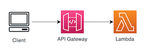

# Simple webservice v2

This is the v2 of the webservice.

## v1

This is the simplest version of the webservice

## v2

In this version, a DynamoDB table has been added to the Lambda Function

Challenge: Test DynamoDB locally with SAM
