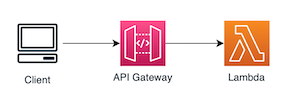
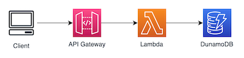
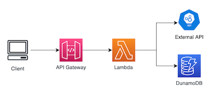

# Simple webservice v3

This is the v3 of the webservice.

## v1

This is the simplest version of the webservice

## v2

In this version, a DynamoDB table has been added to the Lambda Function

Challenge: Test DynamoDB locally with SAM

## v3

In this version, the Lambda Function also connects with an external API

Challenge: deploy my nodejs Lambda Function with an external library (requests)
